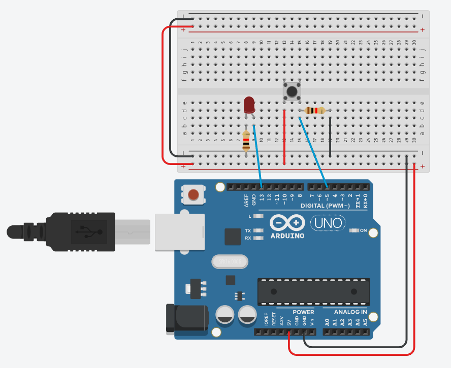
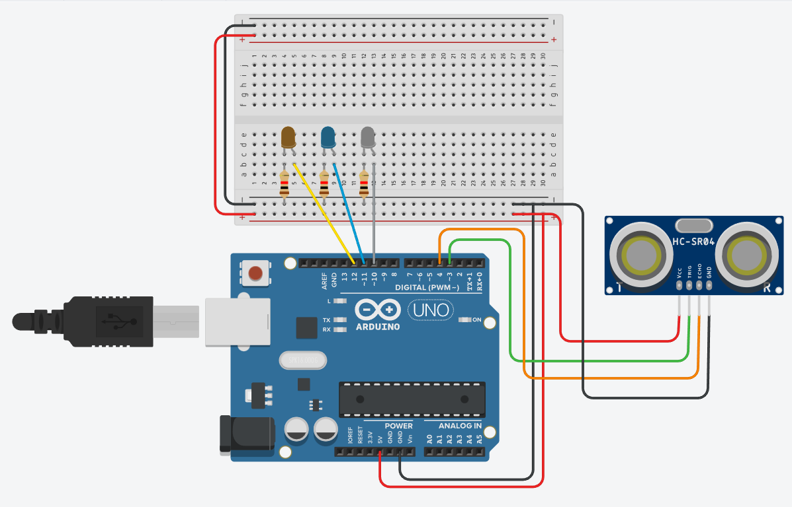
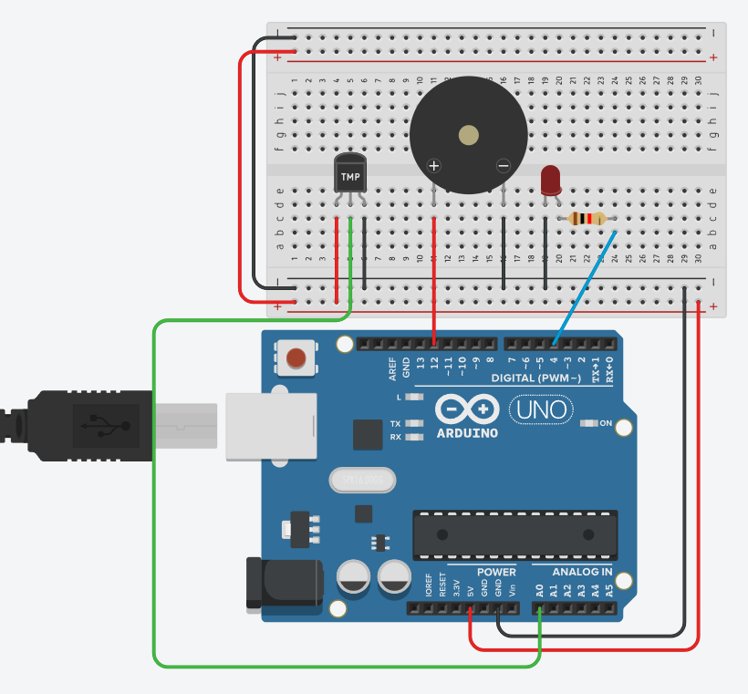

# 🚀 Projetos Arduino – Lista Completa

[⬅ Voltar para o README](./README.md)

Este documento reúne todos os projetos simples de Arduino criados para estudo prático de eletrônica e lógica de programação.  
Cada projeto possui:

- ✔ Explicação clara  
- ✔ Código (dentro da pasta `codes/`)  
- ✔ Imagem da montagem  
- ✔ Link direto para o arquivo `.ino`

---

# 📚 **Índice Geral**

1. [Semáforo Simples](#1---semáforo-simples)  
2. [Semáforo com Pedestre](#2---semáforo-com-pedestre)  
3. [Interruptor Deslizante](#3---interruptor-deslizante)  
4. [Botão (Push Button)](#4---botão-push-button)  
5. [Buzzer](#5---buzzer)  
6. [Display de Sete Segmentos](#6---display-de-sete-segmentos)  
7. [Simulação de Bomba](#7---simulação-de-bomba)  
8. [Sensor de Luz (LDR)](#8---sensor-de-luz-fotoresistor---ldr)  
9. [Potenciômetro](#9---potenciômetro)  
10. [Display LCD](#10---display-lcd)  
11. [Sensor Ultrassônico com LEDs](#11---sensor-ultrassônico-com-leds)  
12. [Sensor de Temperatura TMP36](#12---sensor-de-temperatura-tmp36)

---

---

# 1 - Semáforo Simples

**Descrição detalhada:**  
Este projeto simula o funcionamento básico de um semáforo utilizando LEDs. Ele alterna automaticamente entre os estados: verde → amarelo → vermelho → verde.  
É ideal para aprender **saídas digitais**, **timing com `delay()`** e criar fluxos sequenciais.

- 🔧 *Conceitos*: digitalWrite(), delay(), lógica sequencial  
- 🧩 *Aprendizagem*: controle básico de estados  

  

---

# 2 - Semáforo com Pedestre

**Descrição detalhada:**  
Extensão do projeto anterior, agora adicionando LEDs para representar o sinal de pedestres.  
O LED do pedestre pisca algumas vezes antes de fechar a travessia, usando uma estrutura `for` — introduzindo lógica repetitiva.

- 🔧 *Conceitos*: loops `for`, sincronização de sinais  
- 🧩 *Aprendizagem*: controle de múltiplos dispositivos simultaneamente  

  

---

# 3 - Interruptor Deslizante

**Descrição detalhada:**  
Um exemplo simples e prático do uso de um **slide switch**, que funciona como liga/desliga.  
Quando a chave é movida, o estado lógico muda, ativando ou não o LED conectado ao Arduino.

- 🔧 *Conceitos*: leitura digital com `digitalRead()`  
- 🧩 *Aprendizagem*: diferença entre HIGH/LOW e comportamento de chaves  

  

---

# 4 - Botão (Push Button)

**Descrição detalhada:**  
Demonstra a leitura de um botão comum. Pressionar o botão envia um sinal HIGH para o Arduino, acendendo o LED.  
Ao soltar, o sinal cai para LOW e o LED apaga.  
Ensina na prática como funcionam entradas digitais e o comportamento de botões mecânicos.

- 🔧 *Conceitos*: entradas digitais, lógica condicional  
- 🧩 *Aprendizagem*: como ler interação direta do usuário  

  

---

# 5 - Buzzer

**Descrição detalhada:**  
O projeto utiliza um buzzer piezo para gerar sons simples. Ao aplicar pulsos elétricos, o buzzer vibra e produz áudio.  
Ensina como trabalhar com **saídas sonoras**, introduzindo tons e sinais.

- 🔧 *Conceitos*: pulso elétrico, frequência, delay  
- 🧩 *Aprendizagem*: geração de sons básicos via Arduino  

  

---

# 6 - Display de Sete Segmentos

**Descrição detalhada:**  
Mostra como acender segmentos individuais de um display para formar números.  
O projeto introduz o mapeamento dos pinos responsáveis por cada segmento e o controle manual das combinações que formam os dígitos.

- 🔧 *Conceitos*: mapeamento de segmentos, eletrônica digital  
- 🧩 *Aprendizagem*: lógica para exibir dígitos manualmente  

  

---

# 7 - Simulação de Bomba

**Descrição detalhada:**  
Combina o display de sete segmentos com o buzzer para criar uma contagem regressiva simulada.  
À medida que o tempo se aproxima de zero, o buzzer intensifica o alerta.

- 🔧 *Conceitos*: integração de módulos, contagem regressiva  
- 🧩 *Aprendizagem*: lógica temporal + múltiplas saídas  

  

---

# 8 - Sensor de Luz (Fotoresistor - LDR)

**Descrição detalhada:**  
Mostra como usar um **fotoresistor (LDR)** para detectar luminosidade ambiente.  
Quando o ambiente fica escuro, o Arduino acende um LED. Em ambientes claros, o LED apaga.

- 🔧 *Conceitos*: leitura analógica, sensor resistivo  
- 🧩 *Aprendizagem*: conversão ADC, comportamento de sensores de luz  

  

---

# 9 - Potenciômetro

**Descrição detalhada:**  
Mostra como usar um potenciômetro para **controlar o brilho de um LED**.  
O valor lido (0–1023) é convertido para 0–255 usando `map()`, adequando-se ao PWM necessário para controlar a intensidade.

- 🔧 *Conceitos*: entrada analógica, PWM, map()  
- 🧩 *Aprendizagem*: conversão analógico → brilho LED  

  

---

# 10 - Display LCD

**Descrição detalhada:**  
Utiliza um display LCD 16x2 para exibir textos personalizados.  
O projeto ensina a configurar os pinos, inicializar a biblioteca `LiquidCrystal` e exibir mensagens.

- 🔧 *Conceitos*: comunicação paralela, biblioteca LiquidCrystal  
- 🧩 *Aprendizagem*: exibição de informação em displays alfanuméricos  

  

---

# 11 - Sensor Ultrassônico com LEDs

**Descrição detalhada:**  
Usa o sensor HC-SR04 para medir distâncias e acionar LEDs conforme a proximidade do objeto.  
O sensor envia um pulso e mede o tempo de retorno, calculando a distância.  
Cada faixa de distância aciona um LED diferente, servindo como um "sensor de estacionamento" simples.

- 🔧 *Conceitos*: tempo de eco, cálculo de distância, condicionais  
- 🧩 *Aprendizagem*: integração sensor → lógica visual  

**Códigos disponíveis:**

  
  

---

# 12 - Sensor de Temperatura TMP36

**Descrição detalhada:**  
O sensor TMP36 envia uma tensão proporcional à temperatura.  
O Arduino lê essa tensão e converte para graus Celsius.  
Se a temperatura ultrapassar 30 °C, o projeto acende um LED e toca um buzzer como alerta.

- 🔧 *Conceitos*: leitura analógica, conversão de tensão → temperatura  
- 🧩 *Aprendizagem*: monitoramento ambiental e alertas automáticos  

  

---
