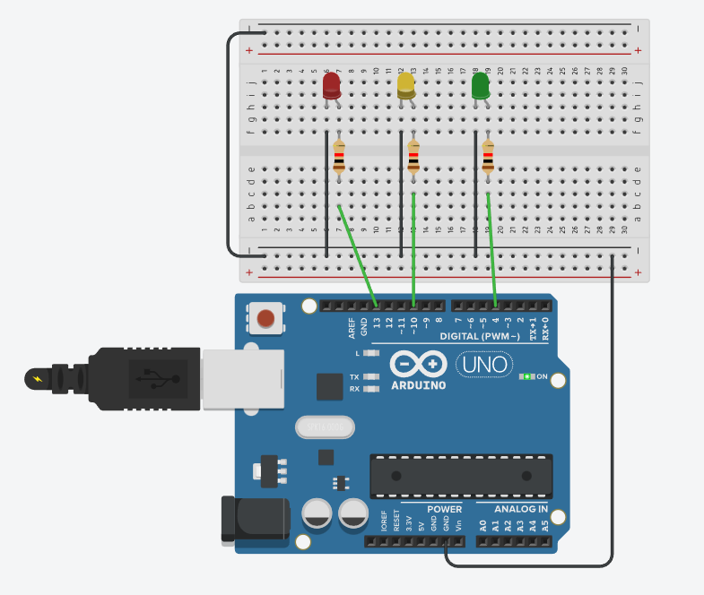

# Código Arduino simples para estudo

### 1 - Interruptor Deslizante
**Descrição:** Aprendendo a usar o componente `slide switch` com um  `led`

### 2 - Stoplight
**Descrição:**  Lógica para acender e apagar um `led`, em tempos alternados 

## 3 - Stoplight with pedestrian

**Descrição:** Uso de mais `led` para simular o pedestre, faz o uso do for para que o pedestre pisque antes de ficar vermelho de novo 

