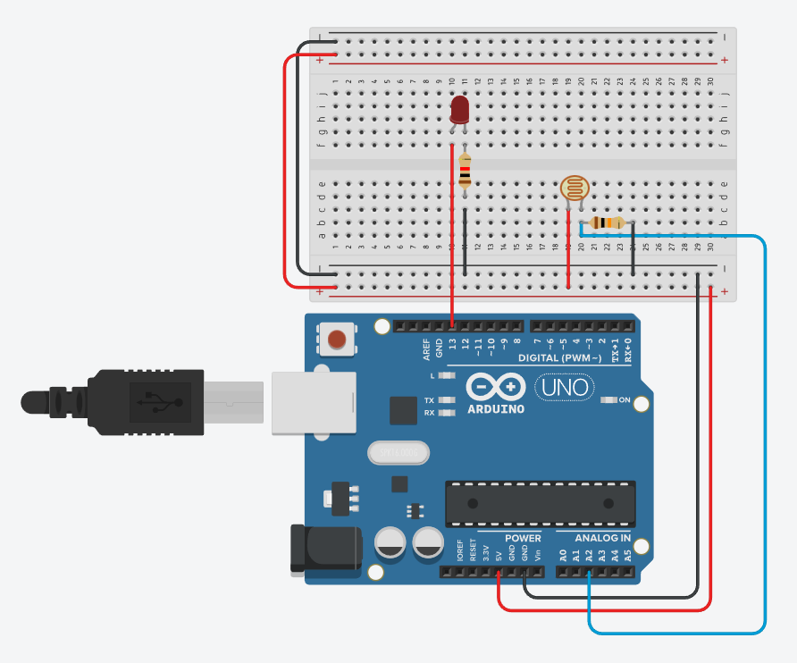
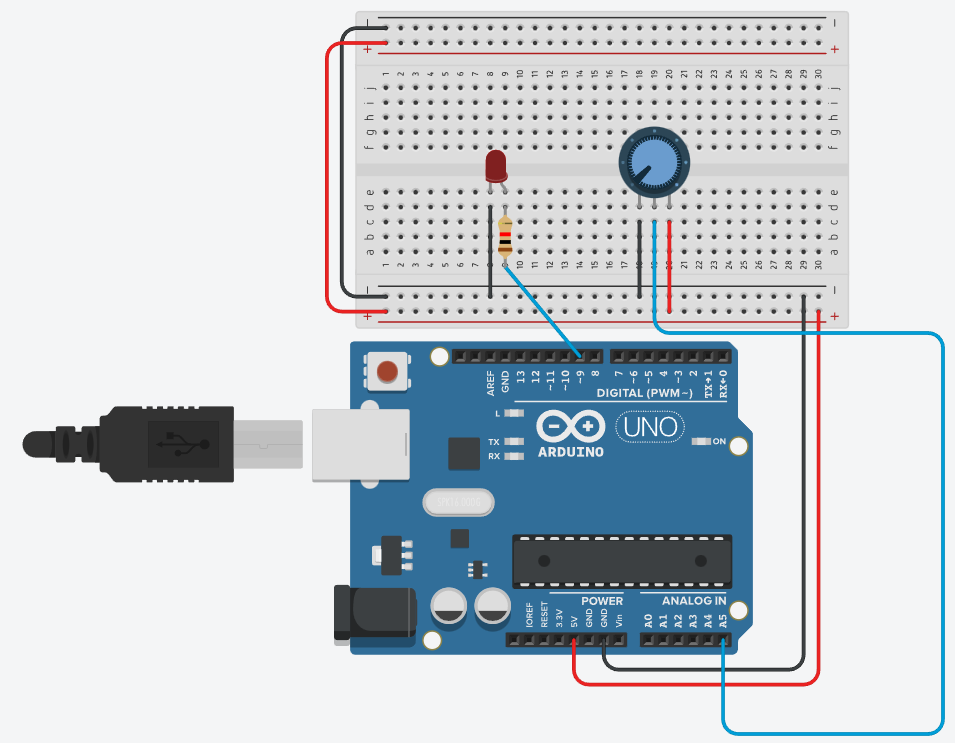
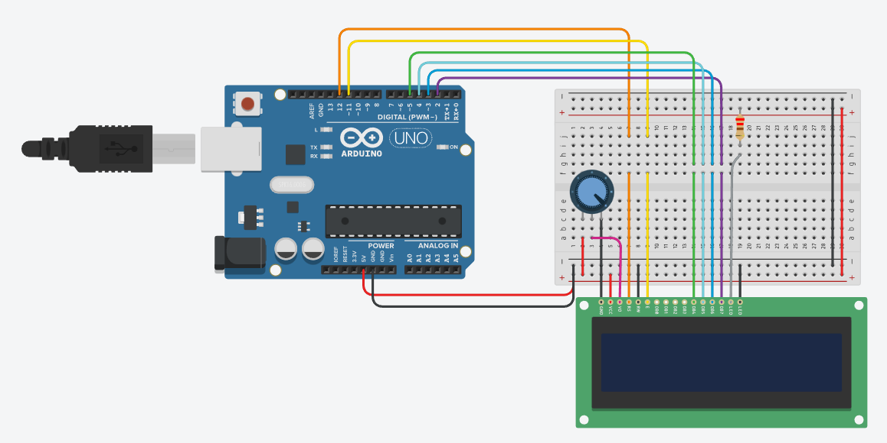

# Código Arduino simples para estudo

### 1 - Semáforo Simples  
**Descrição:** Simulação básica de um semáforo utilizando um LED, com alternância entre os estados ligado e desligado em intervalos definidos de tempo.

  

---

### 2 - Semáforo com Pedestre  
**Descrição:** Ampliação do projeto anterior com LEDs adicionais para simular a passagem de pedestres. Utiliza uma estrutura `for` para piscar o LED do pedestre antes da troca para o sinal vermelho.

  

---

### 3 - Interruptor Deslizante  
**Descrição:** Introdução ao uso do componente `slide switch`. O LED acende ou apaga de acordo com a posição do interruptor, funcionando como uma chave liga/desliga.

  

---

### 4 - Buzzer  
**Descrição:** Projeto que demonstra o uso de um `buzzer` para gerar sons. Permite compreender como controlar sinais sonoros com o Arduino.

  

---

### 5 - Display de Sete Segmentos  
**Descrição:** Utilização do `display de sete segmentos` para exibir números. Os segmentos são ativados individualmente para formar os dígitos.

  

---

### 6 - Simulação de Bomba  
**Descrição:** Projeto que combina o `display de sete segmentos` e o `buzzer` para simular uma contagem regressiva de uma bomba. Trabalha lógica de tempo e saída sonora/visual.

  

---

### 7 - Sensor de Luz (Fotoresistor - LDR)  
**Descrição:** Demonstração do uso de um `fotoresistor (LDR)` para detectar luminosidade. O LED acende automaticamente quando a luz ambiente diminui e apaga quando há claridade.

  

---

### 8 - Potenciômetro  

**Descrição:** Este projeto utiliza um `potenciômetro` para controlar o brilho de um LED. O potenciômetro gera um valor analógico de 0 a 1023, dependendo da posição do seu eixo. Para que esse valor seja usado no controle de brilho (via PWM), é necessário convertê-lo para a faixa de 0 a 255 — que é a faixa aceita pela função `analogWrite()`.  
Isso é feito com a função `map()`, que ajusta proporcionalmente os valores. O LED precisa estar conectado a uma porta PWM do Arduino (identificadas por um símbolo `~` ao lado do número), pois somente essas portas conseguem controlar a intensidade do sinal.

  

--- 

### 9 - Display LCD

**Descrição:**  
Este projeto utiliza um `display LCD 16x2` para exibir mensagens personalizadas. Ele permite que você aprenda a configurar a biblioteca `LiquidCrystal` e enviar textos para o display. É ideal para mostrar informações em tempo real, como sensores, temporizadores ou interações com o usuário.

  

