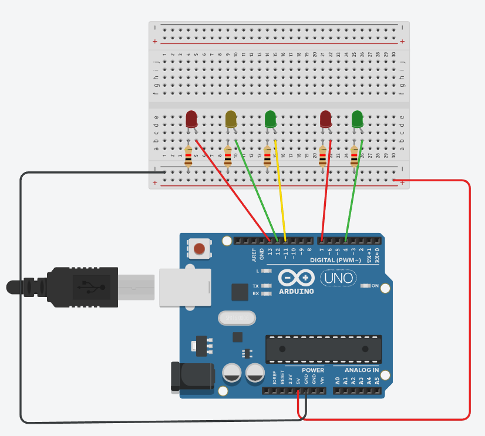

# Código Arduino simples para estudo

### 1 - Stoplight
**Descrição:**  Lógica para acender e apagar um `led`, em tempos alternados 

## 2 - Stoplight with pedestrian

**Descrição:** Uso de mais `led` para simular o pedestre, faz o uso do for para que o pedestre pisque antes de ficar vermelho de novo 

### 3 - Interruptor Deslizante

**Descrição:** Aprendendo a usar o componente `slide switch` com um  `led`

## 4 - Buzzer

**Descrição:** Uso do `buzzer` para produzir sons com o Arduino

## 5 - Display de Sete Segmentos

**Descrição:** Uso do componente `display seven segments` dispositivo com vários leds, que serão ligados e desligados para formar números.

## 6 - Bomba 

**Descrição:** Treinando melhor a lógica usando os componentes `display seven segments` e `buzzer`

